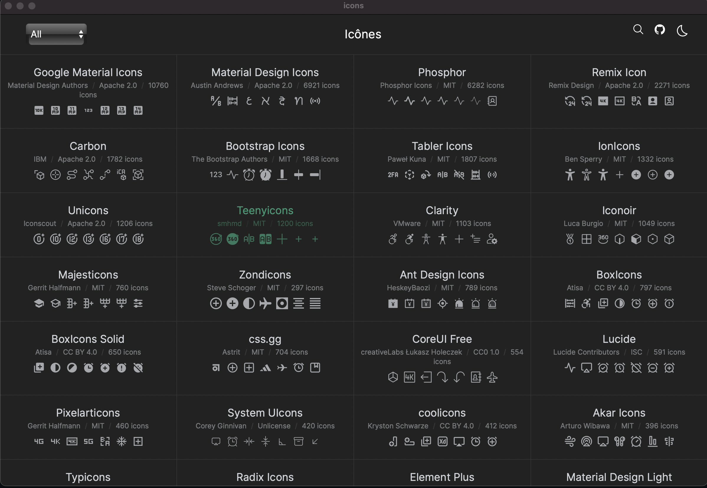
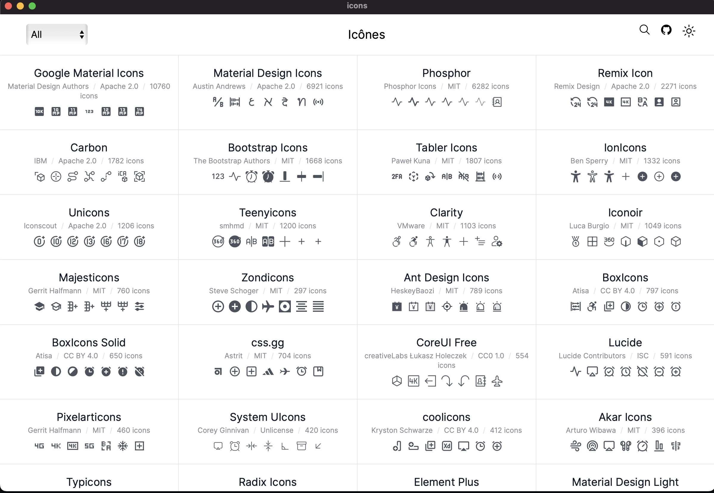

<h1 align="center">Icones Explorer</h1>

  
Icons explorer powered by <a href="https://github.com/iconify/iconify">Iconify</a> with over 100K+ icons

 
 

 
   
 

 
 

> This is very experimental, installers on all platforms should be available in few days to try it out. 

### Acknowledgement

This project was hugely inspired by [icones](https://icones.js.org/)

#### Licence

[MIT](https://github.com/veritem/icons-explorer/blob/main/LICENSE) Licence @2022 - PRESENT [@veritem](https://github.com/veritem)
